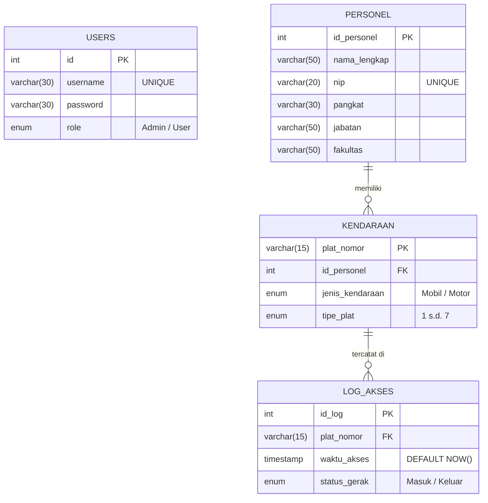

# Entity Relationship Diagram (ERD) - Data Pipeline Unhan RI

Berikut adalah desain skema database relasional (ERD) berdasarkan struktur tabel yang saat ini berjalan di sistem.

### Keterangan Tabel:
1. **USERS**: Tabel *standalone* untuk menyimpan kredensial login akun admin atau pengguna dasbor.
2. **PERSONEL**: Menyimpan data master para pegawai/dosen/militer di lingkungan Unhan. Satu personel dapat memiliki lebih dari satu kendaraan (1 to Many).
3. **KENDARAAN**: Data kendaraan yang didaftarkan. Menggunakan `plat_nomor` sebagai Primary Key.
4. **LOG_AKSES**: Tabel *transactional* yang akan memiliki volume data paling besar. Setiap kali kamera mendeteksi plat, satu *row* akan ditambahkan di sini. Tabel ini berelasi dengan tabel KENDARAAN (1 to Many).
