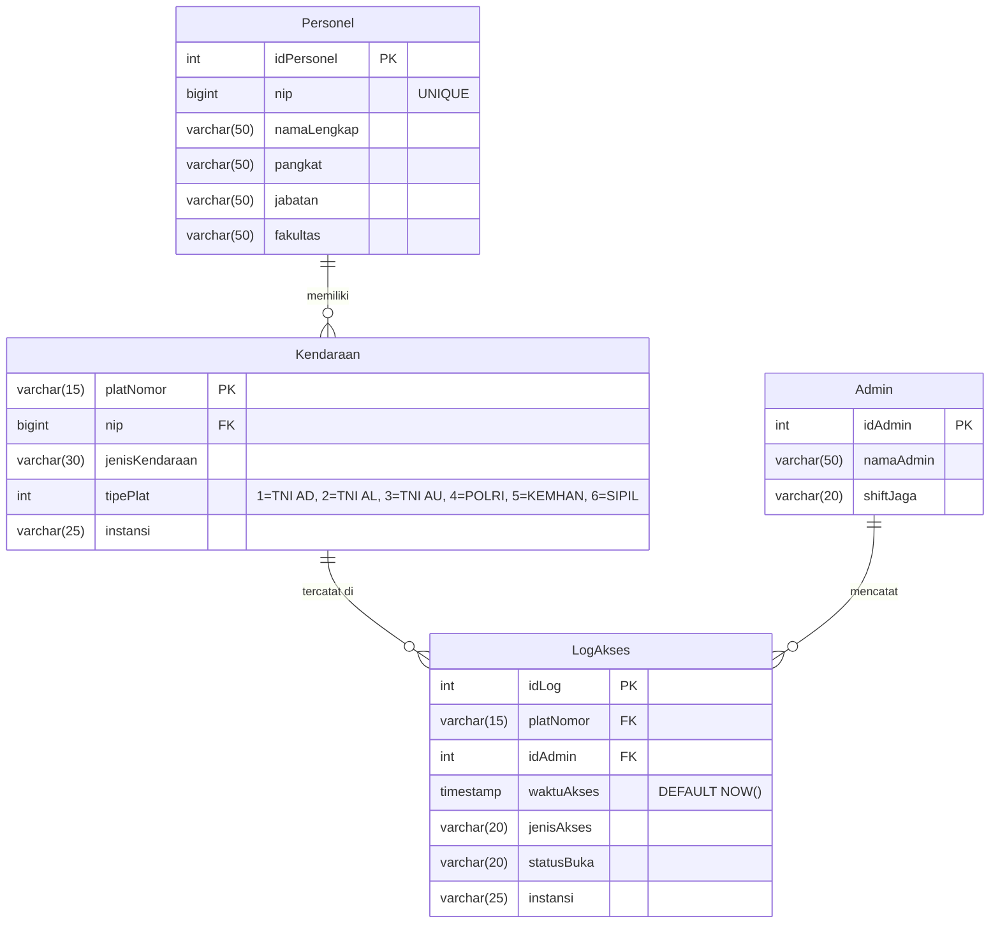

# Entity Relationship Diagram (ERD) - Data Pipeline Unhan RI

Berikut adalah desain skema database relasional (ERD) berdasarkan struktur tabel yang saat ini berjalan di sistem.

### Keterangan Tabel:
1. **Admin**: Tabel untuk menyimpan data admin/petugas jaga.
2. **Personel**: Menyimpan data master para pegawai/dosen/militer di lingkungan Unhan. Berelasi ke tabel kendaraan menggunakan `nip`.
3. **Kendaraan**: Data kendaraan yang didaftarkan. Menggunakan `platNomor` sebagai Primary Key. Menyimpan kode `tipePlat` hasil dari klasifikasi OCR.
4. **LogAkses**: Tabel *transactional* yang akan memiliki volume data paling besar. Setiap kali kamera mendeteksi plat, satu *row* akan ditambahkan di sini. Menyimpan informasi akses, status pintu gerbang, dan instansi.
